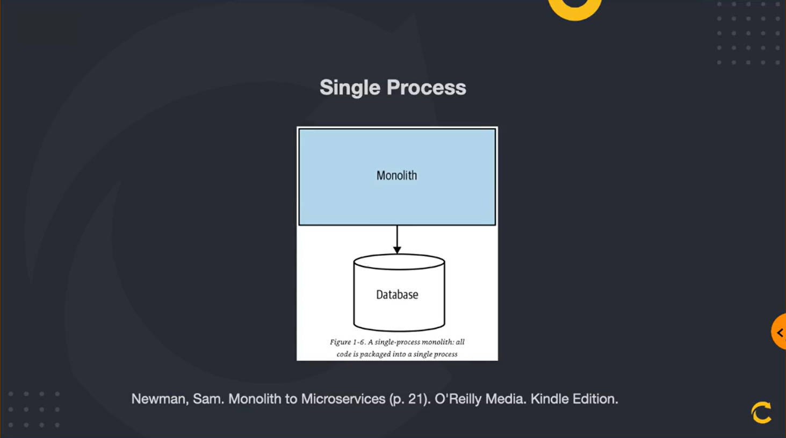
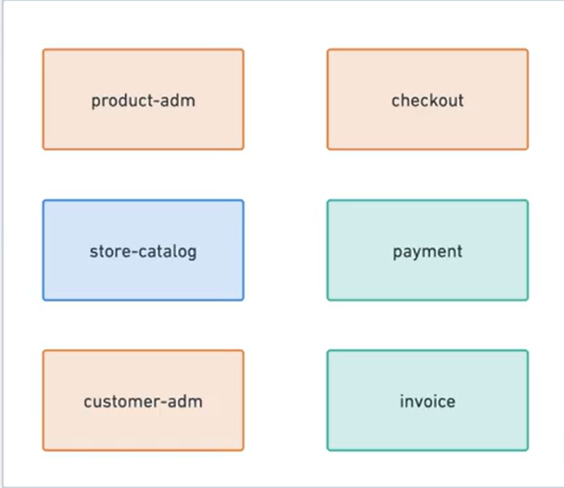
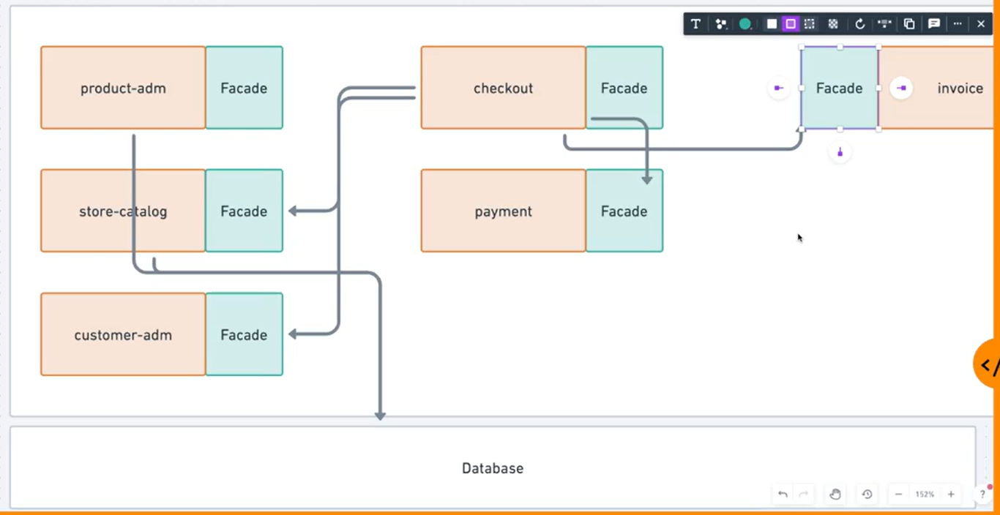

# Sistemas Monolíticos

## O que é um aplicação monolítica?
- Aplicações "tradicionais".
- "Tudo em um".
- Unidade de deployment.

## As polêmicas por trás dos monolitos
- Aplicações da década passada
- Ultrapassada
- Não escalam
- Impedem o crescimento do negócio
- Alto acoplamento

## Monolito em primeiro
- Novos projetos onde o modelo de negócio não está claro.
- Instabilidade no core do negócio.
- Evitar complexidade no processo de deploy.
- Evitar complexidade na operação.
- Artigo do Martin Fowler *MonilithFirst*: https://martinfowler.com/bliki/MonolithFirst.html

## Tipos de Monolito
- "Single process"
- Monolitos distribuídos
- Black box
> - Referência: Newman, Sam. Monilith to Microservices (p.21). O'Reilly Media.

### Single process
O "Single process" pode ser divido em três:
- **Alto acoplamento**:
    - Não existe contexto.
    - Entidades que se relacionam.
    - Não há divisão. Tudo faz parte de tudo. Tudo é grudado em tudo.
    - Efeitos colaterais indesejados.
- **Modular**:
    - DDD é um ponto de partida (contextualizar cada ponto da aplicação).
    - Cada contexto pode virar um módulo da aplicação que acessam o mesmo BD, mitigando desta forma o alto acoplamento.
    - Módulos quebrados em "bounded contexts".
    - Conversam através de contratos e facades para que cada módulo não precise conhecer como o outro módulo processa alguma rotina.
    - Entidades podem ser "duplicadas" tendo apenas os atributos necessários, compartilhando o mesmo ID.
    - Equipes especializadas por módulos.
    - Alta coesão: O que muda junto, permanece junto.
- **Modular com banco de dados segregados**:
    - Cada módulo pode ter o seu próprio banco de dados ou schema.
    - A adesão de módulos gera complexidade.
    - Dificuldade de gerenciar e manter a consistência das informações em bases separadas.

**Se é pra segregar tanto, não é melhor já trabalhar com microsserviços?**
Apesar de parecer fazer sentido migrar, o monolito ainda pode ser mantido devido aos seguintes benefícios:
- Um único deploy.
- Única operação.
- Observabilidade simplificada.
- Sistemas se comunicando internamente.
- Única linguagem. Menos governança.

**Ponto de Atenção**
Quando estiver trabalhando com monolito modulares e houver uma biblioteca/framework/seedwork que é compartilhada em todos os módulos, CUIDADO! Neste caso, é necessário haver políticas bem definidas de como vão funcionar atualizações (correções / manutenções de bugs).

## Estrutura do Projeto
**Nome App:** CodeStore (e-commerce)

**Contextos:**
- product-adm (auxiliar)
- store-catalog (principal)
- customer-adm (auxiliar)
- checkout (auxiliar)
- payment (genérico)
- invoice (genérico)

**Comunicação entre módulos:**
- Uma das formas para diminuir o acoplamento é fazer os módulos se comunicarem através de fachadas (Facade).
- O usecase de um módulo não deve chamar diretamente o usecase de outro módulo. Ao invés disso, o usecase chama o Facade de outro módulo quando houver necessidade.

